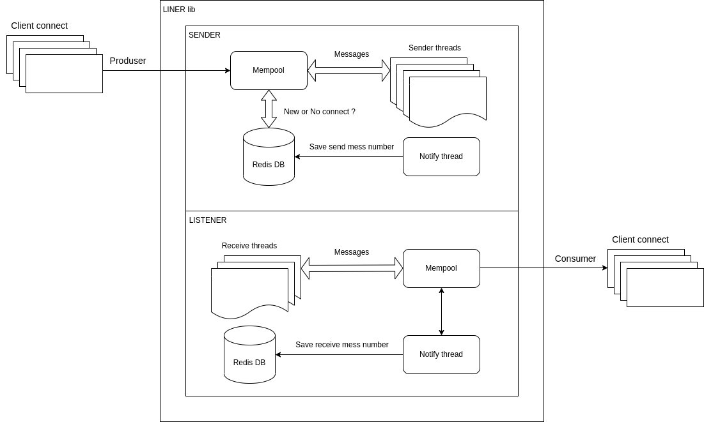

# liner

Redis based message serverless broker.  
The library is written on Rust, C-interface.  
Data transfer via TCP.

Rust example:  
``` Rust
use liner_broker::Liner;

fn  main() {

    let mut client1 = Liner::new("client1", "topic_client1", "localhost:2255", "redis://localhost/");
    let mut client2 = Liner::new("client2", "topic_client2", "localhost:2256", "redis://localhost/");
   
    client1.run(Box::new(|_to: &str, _from: &str, _data: &[u8]|{
        println!("receive_from {}", _from);
    }));
    client2.run(Box::new(|_to: &str, _from: &str, _data: &[u8]|{
        println!("receive_from {}", _from);
    }));

    let array = [0; 100];
    for _ in 0..10{
        client1.send_to("topic_client2", array.as_slice());
        println!("send_to client2");       
    }
}
```

Python example:  
``` Python
def foo():
    client1 = liner.Client("client1", "topic_client", "localhost:2255", "redis://localhost/")
    client2 = liner.Client("client2", "topic_client", "localhost:2256", "redis://localhost/")
    server = liner.Client("server", "topic_server", "localhost:2257", "redis://localhost/")
    
    client1.run(receive_cback1)
    client2.run(receive_cback2)
    server.run(receive_server)
    
    b = b'hello world'
    server.send_all("topic_client", b)
    

def receive_cback1(to: str, from_: str, data: bytes):
    print(f"receive_from {from_}, data: {data}")

def receive_cback2(to: str, from_: str, data: bytes):
    print(f"receive_from {from_}, data: {data}")

def receive_server(to: str, from_: str, data: bytes):
    print(f"receive_from {from_}, data: {data}")
    
```

### Features

 - high message bandwidth ([benchmark](#benchmark))

 - delivery guarantee: at least once delivery (using redis db)

 - message size is not predetermined and is not limited

 - easy api: run client and send data to 

 - interface for Python and CPP

 - crossplatform (linux, windows)
 
 - various messaging options: one-to-one, one-to-many, many-to-many, and topic subscription 
 
### Build
 - install [Rust and Cargo](https://doc.rust-lang.org/cargo/getting-started/installation.html)
 - execute: `cargo build --release`
 
### Architecture of library

<p float="left">
 
</p>

### Examples of use

One to one: [Python](https://github.com/Tyill/liner/blob/main/python/one_to_one.py) / [CPP](https://github.com/Tyill/liner/blob/main/cpp/one_to_one.cpp) / [Rust](https://github.com/Tyill/liner/blob/main/rust/one_to_one.rs)

<p float="left">
 
</p>

One to one for many: [Python](https://github.com/Tyill/liner/blob/main/python/one_to_one_for_many.py) / [CPP](https://github.com/Tyill/liner/blob/main/cpp/one_to_one_for_many.cpp) / [Rust](https://github.com/Tyill/liner/blob/main/rust/one_to_one_for_many.rs)
<p float="left">
 
</p>

One to many: [Python](https://github.com/Tyill/liner/blob/main/python/one_to_many.py) / [CPP](https://github.com/Tyill/liner/blob/main/cpp/one_to_many.cpp) / [Rust](https://github.com/Tyill/liner/blob/main/rust/one_to_many.rs)
<p float="left">
 
</p>

Many to many: [Python](https://github.com/Tyill/liner/blob/main/python/many_to_many.py) / [CPP](https://github.com/Tyill/liner/blob/main/cpp/many_to_many.cpp) / [Rust](https://github.com/Tyill/liner/blob/main/rust/many_to_many.rs)
<p float="left">
 
</p>

Producer-consumer: [Python](https://github.com/Tyill/liner/blob/main/python/producer_consumer.py) / [CPP](https://github.com/Tyill/liner/blob/main/cpp/producer_consumer.cpp) / [Rust](https://github.com/Tyill/liner/blob/main/rust/producer_consumer.rs)
<p float="left">
 
</p>

### [Benchmark](https://github.com/Tyill/liner/blob/main/benchmark)

```
alex@ubuntu2004:~/projects/rust/liner/target/release$ ./throughput_10k 
send_to 8 ms
receive_from 8 ms
send_to 5 ms
receive_from 5 ms
send_to 7 ms
receive_from 3 ms
send_to 11 ms
receive_from 3 ms
send_to 6 ms
receive_from 3 ms
```
10ms on average for 10k messages

```
alex@ubuntu2004:~/projects/rust/liner/benchmark/compare_with_zeromq$ make
g++ -Wall -O2 -std=c++17 -g -Wno-write-strings -o compare_with_zmq compare_with_zmq.cpp -lzmq
alex@ubuntu2004:~/projects/rust/liner/benchmark/compare_with_zeromq$ ./compare_with_zmq 
Connecting to tcp://127.0.0.1:34079
send_to 20.198 ms
send_to 16.504 ms
send_to 11.5 ms
send_to 13.153 ms
send_to 10.964 ms
send_to 10.788 ms
send_to 10.785 ms
send_to 11.119 ms
send_to 11.348 ms
send_to 10.826 ms
```
For ZeroMQ it is similar

### [Tests](https://github.com/Tyill/liner/blob/main/test)

### [Docs](https://docs.rs/liner_broker/1.1.9/liner_broker/)

### License
Licensed under an [MIT-2.0]-[license](LICENSE).

