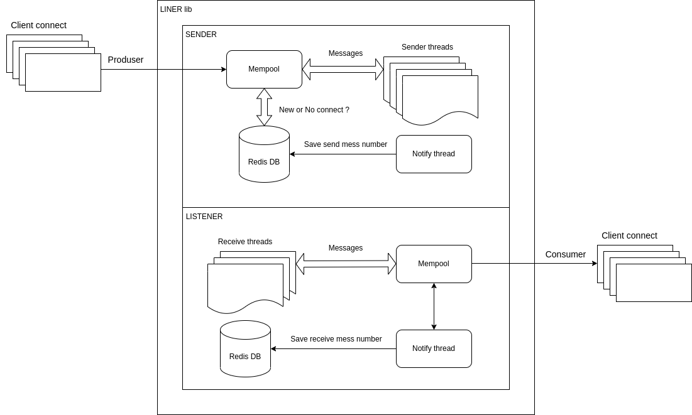
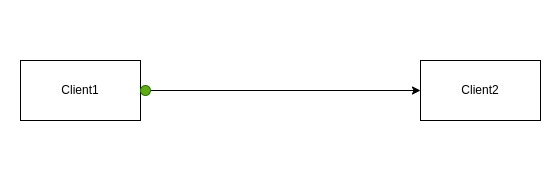
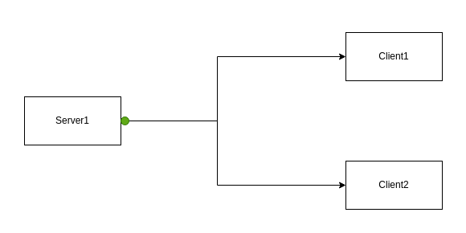
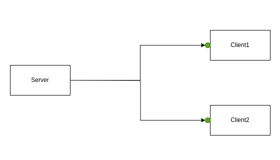
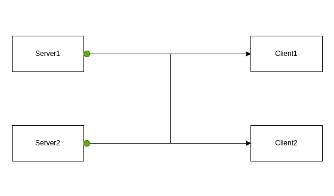
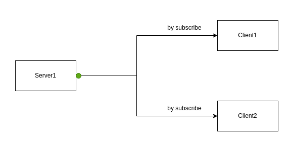

# liner

Redis- or SQLite-backed message broker (serverless style catalog + TCP between peers).  
The library is written in Rust with a C interface.  
Data transfer via TCP.

SQLite: embedded single-file mode (no Redis process). See the guide [docs/using-sqlite.md](docs/using-sqlite.md).

Rust example:  
``` Rust
use liner_broker::Liner;

fn  main() {

    let mut client1 = Liner::new("client1", "topic_client1", "localhost:2255", "redis://localhost/");
    let mut client2 = Liner::new("client2", "topic_client2", "localhost:2256", "redis://localhost/");
   
    client1.run(Box::new(|_to: &str, _from: &str, _data: &[u8]|{
        println!("receive_from {}", _from);
    }));
    client2.run(Box::new(|_to: &str, _from: &str, _data: &[u8]|{
        println!("receive_from {}", _from);
    }));

    let array = [0; 100];
    for _ in 0..10{
        client1.send_to("topic_client2", array.as_slice(), true);
        println!("send_to client2");       
    }
}
```

Python example:  
``` Python
def foo():
    client1 = liner.Client("client1", "topic_client", "localhost:2255", "redis://localhost/")
    client2 = liner.Client("client2", "topic_client", "localhost:2256", "redis://localhost/")
    server = liner.Client("server", "topic_server", "localhost:2257", "redis://localhost/")
    
    client1.run(receive_cback1)
    client2.run(receive_cback2)
    server.run(receive_server)
    
    b = bytearray(b'hello world')
    server.send_all("topic_client", b)  # optional third arg: at_least_once (default True)
    

def receive_cback1(to: str, from_: str, data: bytes):
    print(f"receive_from {from_}, data: {data}")

def receive_cback2(to: str, from_: str, data: bytes):
    print(f"receive_from {from_}, data: {data}")

def receive_server(to: str, from_: str, data: bytes):
    print(f"receive_from {from_}, data: {data}")
    
```

### Features

 - high message bandwidth ([benchmark](#benchmark))

 - delivery guarantee: at least once delivery (store-backed: Redis or SQLite)

 - SQLite backend: file per deployment / per process ([docs/using-sqlite.md](docs/using-sqlite.md))

 - message size is not predetermined and is not limited

 - easy api: run client and send data to 

 - interface for Python and CPP

 - crossplatform (linux, windows)
 
 - various messaging options: one-to-one, one-to-many, many-to-many, and topic subscription 
 
### Build
 - install [Rust and Cargo](https://doc.rust-lang.org/cargo/getting-started/installation.html)
 - execute: `cargo build --release`
 
### Architecture of library

<p float="left">
 
</p>

### Examples of use

One to one: [Python](https://github.com/Tyill/liner/blob/main/python/one_to_one.py) / [CPP](https://github.com/Tyill/liner/blob/main/cpp/one_to_one.cpp) / [Rust](https://github.com/Tyill/liner/blob/main/rust/one_to_one.rs)

<p float="left">
 
</p>

One to one for many: [Python](https://github.com/Tyill/liner/blob/main/python/one_to_one_for_many.py) / [CPP](https://github.com/Tyill/liner/blob/main/cpp/one_to_one_for_many.cpp) / [Rust](https://github.com/Tyill/liner/blob/main/rust/one_to_one_for_many.rs)
<p float="left">
 
</p>

One to many: [Python](https://github.com/Tyill/liner/blob/main/python/one_to_many.py) / [CPP](https://github.com/Tyill/liner/blob/main/cpp/one_to_many.cpp) / [Rust](https://github.com/Tyill/liner/blob/main/rust/one_to_many.rs)
<p float="left">
 
</p>

Many to many: [Python](https://github.com/Tyill/liner/blob/main/python/many_to_many.py) / [CPP](https://github.com/Tyill/liner/blob/main/cpp/many_to_many.cpp) / [Rust](https://github.com/Tyill/liner/blob/main/rust/many_to_many.rs)
<p float="left">
 
</p>

Producer-consumer: [Python](https://github.com/Tyill/liner/blob/main/python/producer_consumer.py) / [CPP](https://github.com/Tyill/liner/blob/main/cpp/producer_consumer.cpp) / [Rust](https://github.com/Tyill/liner/blob/main/rust/producer_consumer.rs)
<p float="left">
 
</p>

### [Benchmark](https://github.com/Tyill/liner/blob/main/benchmark)

Two binaries stress the same **pair of clients + `send_to`** workload; only the **store** differs:

- **`bench_pair_sendto_redis`** — Redis catalog (`redis://localhost/`). `cargo build --release --bin bench_pair_sendto_redis` → `./bench_pair_sendto_redis`.
- **`bench_pair_sendto_sqlite`** — **one** shared temp SQLite file for both clients (same idea as one Redis URL), so listener acks and sender reads hit the same `conn_mess_number`. Fixed bind addresses; each side’s `receivers_json` lists **only the peer** (topic / addr / `client_name`). `cargo build --release --bin bench_pair_sendto_sqlite` → `./bench_pair_sendto_sqlite`.

```
alex@ubuntu2004:~/projects/rust/liner/target/release$ ./bench_pair_sendto_redis 
send_to 8 ms
receive_from 8 ms
send_to 5 ms
receive_from 5 ms
send_to 7 ms
receive_from 3 ms
send_to 11 ms
receive_from 3 ms
send_to 6 ms
receive_from 3 ms
```
10ms on average for 10k messages

```
alex@ubuntu2004:~/projects/rust/liner/benchmark/compare_with_zeromq$ make
g++ -Wall -O2 -std=c++17 -g -Wno-write-strings -o compare_with_zmq compare_with_zmq.cpp -lzmq
alex@ubuntu2004:~/projects/rust/liner/benchmark/compare_with_zeromq$ ./compare_with_zmq 
Connecting to tcp://127.0.0.1:34079
send_to 20.198 ms
send_to 16.504 ms
send_to 11.5 ms
send_to 13.153 ms
send_to 10.964 ms
send_to 10.788 ms
send_to 10.785 ms
send_to 11.119 ms
send_to 11.348 ms
send_to 10.826 ms
```
For ZeroMQ it is similar

### [Tests](https://github.com/Tyill/liner/blob/main/test)

Run Rust unit tests:

```bash
cargo test
```

Run Rust integration test with Redis (ignored by default):

```bash
LINER_TEST_REDIS=redis://localhost/ cargo test --test offline_delivery_redis -- --ignored

cargo build --release
python3 test/run_integration.py --list
```

You can filter or keep running after failures:

```bash
python3 test/run_integration.py --only offline,burst
python3 test/run_integration.py --continue-on-fail
```

Python tests will auto-start Redis via Docker if it isn't reachable.
You can customize the port/container name:

```bash
LINER_TEST_REDIS_PORT=16379 LINER_TEST_REDIS_CONTAINER=liner-test-redis python3 test/offline_delivery_more.py
```

SQLite-backed Python integration tests (no Redis; shared temp DB per script):

```bash
cargo build --release
python3 test/sqlite/run_integration.py
```

### Docs

- [Using SQLite (`new_sqlite`, `receivers_json`, reference test walkthrough)](docs/using-sqlite.md)
- [Crate API on docs.rs](https://docs.rs/liner_broker/1.3.0/liner_broker/)
- [Developer notes (errors, backends, C API, lifecycle)](docs/README.md)
- [C API compatibility and building (symbols, `cargo`, Linux/Windows)](docs/c-api-compatibility-and-build.md)

### License
Licensed under an [MIT-2.0]-[license](LICENSE).

