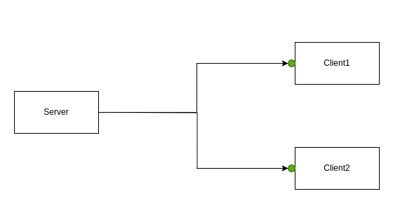

# liner

Redis based message serverless broker.  

Python example:
``` Python

def foo():
    client1 = liner.Client("client1", "topic_client", "localhost:2255", "redis://localhost/")
    client2 = liner.Client("client2", "topic_client", "localhost:2256", "redis://localhost/")
    server = liner.Client("server", "topic_server", "localhost:2257", "redis://localhost/")
    
    client1.run(receive_cback1)
    client2.run(receive_cback2)
    server.run(receive_server)
    
    b = b'hello world'
    server.send_all("topic_client", b, len(b), True)
    

def receive_cback1(to: str, from_: str, data: bytes):
    print(f"receive_from {from_}, data: {data}")

def receive_cback2(to: str, from_: str, data: bytes):
    print(f"receive_from {from_}, data: {data}")

def receive_server(to: str, from_: str, data: bytes):
    print(f"receive_from {from_}, data: {data}")
    
```

### Features

 - high speed transmission of multiple messages ([benchmark](https://github.com/Tyill/liner/blob/main/benchmark))

 - delivery guarantee: at least once delivery (using redis db)

 - message size is not predetermined and is not limited

 - easy api: create client, run client and send data to 

 - interface for Python and CPP
 
 
### Examples of use

One to one: [Python](https://github.com/Tyill/liner/blob/main/python/one_to_one.py) / [CPP](https://github.com/Tyill/liner/blob/main/cpp/one_to_one.cpp)

<p float="left">
 
</p>

One to one for many: [Python](https://github.com/Tyill/liner/blob/main/python/one_to_one_for_many.py) / [CPP](https://github.com/Tyill/liner/blob/main/cpp/one_to_one_for_many.cpp)
<p float="left">
 
</p>

One to many: [Python](https://github.com/Tyill/liner/blob/main/python/one_to_many.py) / [CPP](https://github.com/Tyill/liner/blob/main/cpp/one_to_many.cpp)
<p float="left">
 
</p>

Many to many: [Python](https://github.com/Tyill/liner/blob/main/python/many_to_many.py) / [CPP](https://github.com/Tyill/liner/blob/main/cpp/many_to_many.cpp)
<p float="left">
 
</p>

Producer-consumer: [Python](https://github.com/Tyill/liner/blob/main/python/producer_consumer.py) / [CPP](https://github.com/Tyill/liner/blob/main/cpp/producer_consumer.cpp)
<p float="left">
 
</p>

### [Benchmark](https://github.com/Tyill/liner/blob/main/benchmark)

### [Tests](https://github.com/Tyill/liner/blob/main/test)

### [Wiki](https://github.com/Tyill/liner/wiki)

### [Crates.io](https://crates.io/crates/liner_broker)

### License
Licensed under an [MIT-2.0]-[license](LICENSE).

